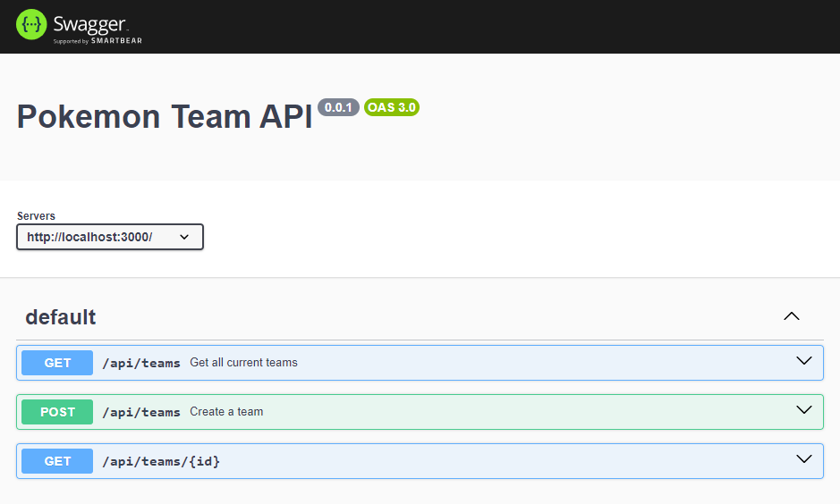
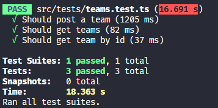

# Desafio Triágil

## Introdução
Esse repositório é dedicado para resolver o desafio proposto no link: https://github.com/triagilbr/desafio-triagil

## Endpoints disponível

### Get

#### /api/teams

Este endpooint retorna todos os times até então criados. 
Exemplo:

  {
	"1": {
		"owner": "Ash",
		"pokemons": [
			{
				"id": 25,
				"name": "pikachu",
				"weight": 60,
				"height": 4
			},
			{
				"id": 9,
				"name": "blastoise",
				"weight": 855,
				"height": 16
			}
		]
	}
}

### GET:id 

#### /api/teams/:id

Este endpoint retorna uma determinada equipe baseada no seu id.

### POST

#### /api/teams

Executar um post nesse endpoint cria uma nova equipe com base no nome do dono da equipe e a lista de pokemons.

Exemplo de uma requisiçâo:

  {
	"owner": "Ash",
	"team": ["charmander", "blastoise"]
}

## Documentaçâo

A documentação dese projeto foi criada usando Swagger. Pode ser acessada no endpoint: /api-docs

  

## Testes

Todos os endpoint mencionados foram testados usando a biblioteca jest para garantir que estejam funcionando de forma apropriada.

  

## Inicializar o projeto

Basta rodar o comando: 

docker build -t triagil_challenger
docker run -p 3000:3000 triagil_challenger

## Obrigado por acompanhar!

Agradeço a oportunidade de participar deste desafio, pude colocar em prática meus conhecimentos e aprender mais.
Acompanhe para mais projetos
